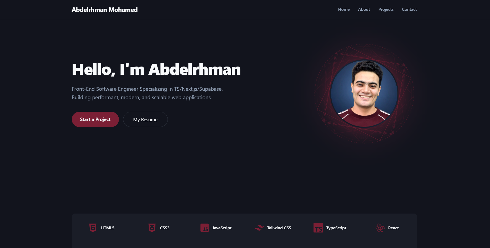

# 💼 Abdelrhman Mohamed Portfolio

<p align="center">
  
</p>

<p align="center">
  A modern, responsive developer portfolio built with <strong>Next.js 16</strong>, <strong>React 19</strong>, <strong>TypeScript</strong>, and <strong>Tailwind CSS 4</strong>.
</p>

<p align="center">


</p>

---

## 🌐 Live Demo

**Website:** https://abdelrhman.online

---

# ✨ Features

- 🎨 Modern responsive UI
- 🏗 Layer-Based Architecture
- 📱 Mobile-first design
- 🚀 Dynamic featured projects fetched directly from GitHub
- 📧 Contact form powered by Next.js Server Actions
- ✅ Server-side validation with Zod
- 📩 Email delivery using Resend
- 🔍 Complete SEO optimization
- 🌍 Open Graph & Twitter Cards
- 📄 JSON-LD Structured Data
- 🤖 Robots.txt & Sitemap
- ⚡ Fast performance with Next.js App Router

---

# 🛠 Tech Stack

## Frontend

- Next.js 16
- React 19
- TypeScript
- Tailwind CSS 4
- Framer Motion
- Lucide React
- React Icons

## Backend

- Next.js Server Actions
- Resend
- GitHub REST API (Octokit)
- Zod

---

# 🏗 Architecture

This project follows a **Layer-Based Architecture** to separate responsibilities and keep the codebase scalable and maintainable.

```
                 User
                   │
                   ▼
             React Components
                   │
                   ▼
            Next.js Server Actions
                   │
                   ▼
               Services Layer
                   │
                   ▼
            Repository Layer
                   │
                   ▼
        GitHub API / Resend API
```

### Layers

### Components

Responsible for the presentation layer and user interface.

```
components/
```

---

### Actions

Handle user interactions and server-side form submissions.

```
lib/actions/
```

---

### Services

Contain business logic and transform data before it reaches the UI.

```
lib/services/
```

---

### Repositories

Responsible for communicating with external APIs.

```
lib/repositories/
```

---

### Data

Static application data.

```
data/
```

---

### Constants

Shared constants used throughout the application.

```
constants/
```

---

### Types

Shared TypeScript interfaces.

```
types/
```

---

# 🚀 Dynamic Featured Projects

Featured projects are fetched dynamically from the GitHub API.

Only repositories containing a topic like:

```
portfolio-order-1
portfolio-order-2
portfolio-order-3
```

will be displayed.

The order number determines the display order.

Any additional GitHub topics are automatically rendered as technology badges.

---

# 📬 Contact Form

The contact section includes:

- Next.js Server Actions
- Zod Validation
- Resend Email API
- HTML Escaping
- Loading State
- Success/Error Handling

---

# 🔍 SEO

The portfolio includes:

- Metadata API
- Open Graph
- Twitter Cards
- JSON-LD
- Sitemap
- Robots.txt
- Web Manifest

---

# 📂 Folder Structure

```
app/
components/
constants/
data/
lib/
 ├── actions/
 ├── repositories/
 └── services/
public/
types/
```

---

# ⚙️ Environment Variables

Create a `.env.local` file.

```env
GITHUB_USERNAME=your_github_username
GITHUB_TOKEN=your_github_token

RESEND_API_KEY=your_resend_api_key

MY_EMAIL=your_email@example.com
```

---

# 📦 Installation

Clone the repository.

```bash
git clone https://github.com/your-username/portfolio.git
```

Move into the project.

```bash
cd portfolio
```

Install dependencies.

```bash
npm install
```

Start the development server.

```bash
npm run dev
```

Create a production build.

```bash
npm run build
```

---

# 👨‍💻 Author

**Abdelrhman Mohamed**

Frontend Developer

🌐 Portfolio  
https://abdelrhman.online

🐙 GitHub  
https://github.com/abdelrahmanmohamed-web

💼 LinkedIn  
https://www.linkedin.com/in/abdelrhman-mohammad-683632337

---

# 📄 License

This project is licensed under the MIT License.
